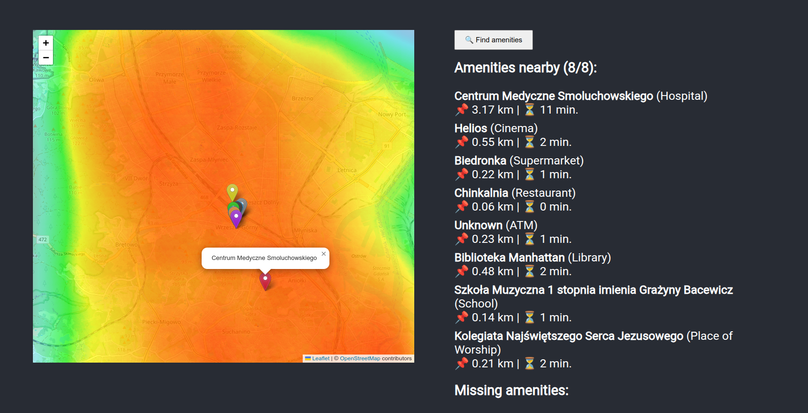
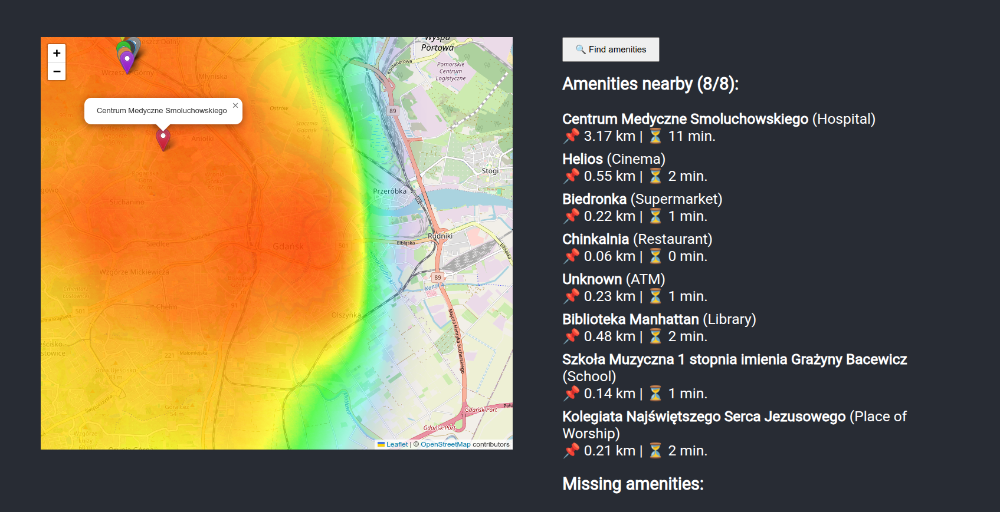
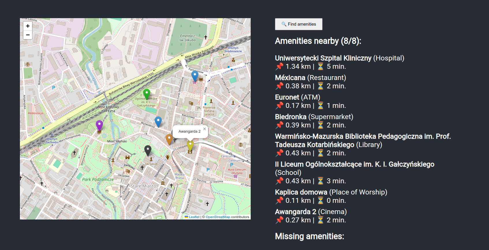

# 🌆 15-Minute City

**15-Minute City** is a web-based application that visualizes local amenities (e.g., supermarkets, schools, libraries, hospitals) within a 15-minute walking or driving distance from a selected location. It helps users assess how self-sufficient and accessible a neighborhood is, following the urban planning concept of the 15-minute city.

---

## 🚀 Features

- Interactive heatmap showing accessibility zones
- Nearby amenities detection and categorization
- Travel distance and estimated time to amenities
- Amenity search and filtering
- Clear visual markers for different types of locations

---

## 🧑‍💻 Technologies Used

### Frontend
- React.js with Leaflet.js for map rendering
- Tailwind CSS or styled components (if used)

### Backend
- Java with Spring Boot (SDK 21)
- API endpoint serving amenity and location data
- OpenStreetMap integration for geo services

---

## 🏁 Getting Started

### Prerequisites
- Node.js & npm
- Java SDK 21
- Spring Boot CLI or your preferred IDE (e.g., IntelliJ IDEA)

---

## 📦 Installation

1. Clone the repository:
   ```console
   git clone https://github.com/Wleszcz/FMC
   cd 15-minute-city
   ```
2. Start the frontend:
   ```console
   cd frontend
   npm install
   npm start
   ```
   This runs the app in development mode. Open http://localhost:3000 to view it in the browser.

3. Start the backend (Spring Boot):
   Make sure you have Java SDK 21 installed and set up.

   ```console
   cd backend
   ./mvnw spring-boot:run
   ```

   The backend will start on http://localhost:8080 by default.

---

## 📸 Screenshots

Sample Visualizations:
- Accessibility heatmaps
- Detailed amenity listings
- Travel times shown dynamically



---

## 📌 Future Enhancements

- Add user authentication for saved locations
- Extend support for biking and public transport times
- More granular amenity categories (parks, gyms, pharmacies, etc.)
- Mobile-first responsive design improvements

---

## 👥 Contributors

- Wiktor Leszczyński (@Wleszcz)
